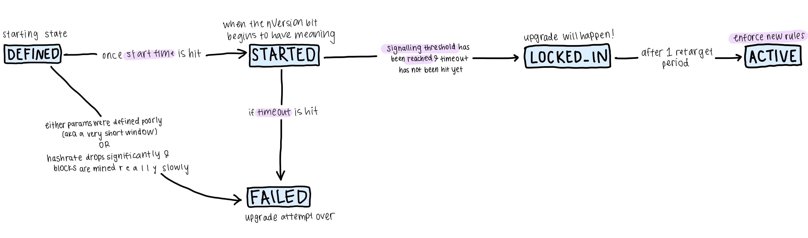

## TLDR: Activation History

#### BIP 34
- Since BIP 34, proposed and implemented in 2012, nodes coordinated soft fork
  upgrades using the `nVersion` field on blocks. The usage was simple, the
  field held a number that was incremented to signal upgrade readiness. After
  95% of a rolling 1000 blocks signalled support, the upgrade activated.
- BIP 34 was used to deploy (1) block height in coinbase (2) `OP_CLTV` and (3)
  `DER` signatures.
- The two main issues with this technique were that (1) there was no way to
  permanently fail a deployment attempt (2) only one soft fork could be
  attempted at a time.

#### BIP 9
- BIP 9 addressed these issues by turning the `nVersion` field into a bit
  field, where each bit represents an active deployment attempt. It also
  introduced the idea of "retarget periods" of 2016 blocks. If 95% of
  blocks within a retarget period signalled support, the soft fork would
  activate after waiting another retarget period. If signalling was
  insufficient, the upgrade attempt would fail, and the consensus rules would
  not change.
- BIP 9 was first used in Bitcoin Core to deploy `OP_CSV`, which quickly
  activated. It was used again to attempt activating Segwit, but became
  controversial. Although Segwit had community support, miners were not
  signalling readiness and it seemed as if the 1 year time out could be hit
  without the soft fork activating.

#### Alternative Signaling Mechanisms
- Several alternative BIPs were proposed, and they introduced 2 main ideas (1)
  flag day after timeout: if lock-in is not achieved, instead of failing,
  activate the soft fork (2) mandatory signalling: at some point, validating
  nodes begin to reject blocks that are not signalling support for the upgrade.
  This concept is commonly referred to as UASF. BIP 148 gained the most
  societal traction, but none of the BIPs were accepted into Bitcoin Core. In
  the end, Segwit successfully activated via BIP 9.
- While most of the alternative BIPs dwindled, BIP 8 continued development post
  Segwit activation. The biggest change is introducing a boolean
  (`lockintimeout`) to potentially enable mandatory signalling after a period
  of time, then subsequently mandatory activation. The community has been
  unable to come to consensus on how to set this boolean.
- "Speedy Trial" is a current front-runner as the method to attempt Taproot
  activation. It gives miners 3 months to achieve a 90% threshold and lock-in
  Taproot. If successful, there would still be a several month delay until
  activation to allow the community to upgrade their nodes. There are currently
  2 implementations opened as PRs in Bitcoin Core and no associated BIPs. The
  key difference in the PRs is whether retarget periods and timeouts are
  measured with timestamps (Median Time Past per BIP 9) or with block intervals
  (based on BIP 8).
- Other activation technqiues are still being discussed and explored,
  particularly on the mailing list and irc.

## A Deeper Dive Into the BIPs
#### BIP 34 / `IsSuperMajority()`
- `IsSuperMajority()` introduced using the `nVersion` field of a block header.
  The field was treated as a number, and incrementing the number signalled
  support for a soft-fork upgrade.
- If 75% of the last 1000 blocks signalled support, nodes would begin validating
  the signalling blocks to the new rules.
- Once 95% of the last 1000 blocks signalled support, blocks mined with the old
  rules would be rejected.
- Implemented in Bitcoin Core in
  [#1526](https://github.com/bitcoin/bitcoin/pull/1526). `nVersion` was bumped
  from `1` to `2` to coordinate adding block height as first bytes of the
  coinbase.
- This deployment technique was reused for `OP_CLTV`, and
  enforcing `DER` signature encoding.
- Problems with this technique included:
  - Using numbers sequentially meant there was no way to cancel a deployment.
  - No way to deploy multiple soft forks in parallel.
  - The rolling window meant the soft fork could be activated at any time.
  - Validating after 75% signalling is unsafe- a miner could game this and
    double spend transactions.

#### BIP 9
- Use the `version` field as a bitfield instead of a number. Each bit can be
  used to track an independent change. This would allow multiple soft forks to
  be deployed in parallel, and allows a soft fork to be permanently rejected.
- Introduced fixed retarget periods of 2016 blocks (approximately 2 weeks). A
  block's retarget period is calculated with `floor(block_height / 2016)`
- The retarget periods primarily allow some predictability to when the upgrade
  would occur.

- Each deployment specifies
  1. bit position - the specific bit in `nVersion`
  2. start time - when signalling begins
  3. timeout - when the deployment attempt expires (1 year recommended)
  4. threshold - number of blocks needed to achieve the upgrade (95% for mainnet)

- These pieces of information are used to advance blocks through the state
  machine:

</img>

- At the beginning of each retarget period, the state is recalculated based on
  the previous state and other relevant information (signalling, params, MTP,
  etc.)
- All blocks in a retarget period have the same state. The state will not be
  recalculated until the beginning of the following retarget period.
- Advancing from `STARTED` -> `LOCKED_IN` requires at least 95% of blocks in
  the previous retarget period to have signalled.
- The start time and the timeout specify a POSIX timestamp used in comparison
  to the median time past of the block (median `nTime` of a block and its 10
  predecessors).

- BIP 9 was used to deploy `OP_CSV`, which quickly activated. It was used again
  to attempt activating Segwit, but became controversial.  Although Segwit had
  community support, miners were not signalling readiness and it seemed as if
  the 1 year time out could be hit without the soft fork activating. During
  this window, several alternative BIPs were proposed. In the end, Segwit
  successfully activated via BIP 9.

#### Alternative BIPs
- While Segwit activation was waiting for miner signalling in the BIP 9
  `STARTED` state, many alternative techniques were proposed to attempt
  increasing the likelihood of successful activation. None of them were
  accepted into Bitcoin Core.

- Mandatory signalling involves rejecting blocks that do not signal for BIP 9
  activation. Flag day activation involves activating the consensus upgrade
  whether or not the signalling threshold was met.
- BIP 8 (02/21/2017): BIP 9 with mandatory signalling and flag day activation.
- BIP 148 (03/12/2017): Mandatory signalling until the BIP 9 Segwit Activation
  locked in or timed out. At the time, this BIP was the most widely supported,
  with some alternative clients implementing the BIP into a release.
- BIP 149 (04/14/2017): BIP 9 with flag day activation.
- BIP 91 (05/22/2017): proposed miners signal Segwit support on a different
  version bit, and if 80% of the blocks signalled over a ~3 day window, would
  have mandatory signalling of the BIP 9 Segwit deployment.

#### Current Taproot Activation Proposals
- While many activation ideas are being explored on the mailing list and IRC,
  this section focuses on those that are being developed within the github
  repos (bitcoin/bips and bitcoin/bitcoin)

- Most of the alternative BIPs that were proposed during the Segwit activation
  have dwindled in their development and support, except for BIP 8.

- BIP 8 is very similiar to BIP 9 with two main differences.
  1. Mandatory signalling & flag day: `lockintimeout` is a new deployment
     parameter. If set to true, even if the threshold signalling is not met,
     blocks will transition to a `MUST_SIGNAL` phase where, for one retarget
     period, they will reject all blocks that do not signal for the upgrade.
     Blocks will always advance to `LOCKED_IN` and subsequently `ACTIVE`.
  2. Two activation parameters, `startheight` and `timeoutheight`, are
     specified in block heights instead of timestamps. This is meant to
     mitigate against risk of fluctuating hashrate, and create more reliability
     since block height is more consistent than block time and MTP.

- "Speedy Trial" is a new idea and a current front-runner as the method to
  attempt Taproot activation. It gives miners 3 months to achieve a 90%
  threshold and lock-in Taproot. If successful, there would still be a several
  month delay until activation to allow the community to upgrade their nodes.
  There are currently 2 implementations opened as PRs in Bitcoin Core and no
  associated BIPs. The key difference in the PRs is whether retarget periods
  are measured with timestamps (Median Time Past per BIP 9) or with block
  intervals (based on BIP 8).

# Further Reading

- For a summary of ongoing activation discussions, Bitcoin Optech Newsletters
  [#139](https://bitcoinops.org/en/newsletters/2021/03/10/) and
  [#137](https://bitcoinops.org/en/newsletters/2021/02/24/)

- Speedy Trial: [write
up](https://lists.linuxfoundation.org/pipermail/bitcoin-dev/2021-March/018583.html),
Bitcoin Core [PR based on BIP
9](https://github.com/bitcoin/bitcoin/pull/21377), Bitcoin Core [PR based on
BIP 8](https://github.com/bitcoin/bitcoin/pull/21392).

- BIPs mentioned in this write up: [BIP
  34](https://github.com/bitcoin/bips/blob/master/bip-0034.mediawiki), [BIP
  9](https://github.com/bitcoin/bips/blob/master/bip-0009.mediawiki), [BIP
  8](https://github.com/bitcoin/bips/blob/master/bip-0008.mediawiki), [BIP
  148](https://github.com/bitcoin/bips/blob/master/bip-0148.mediawiki), [BIP
  149](https://github.com/bitcoin/bips/blob/master/bip-0149.mediawiki), [BIP
  91](https://github.com/bitcoin/bips/blob/master/bip-0091.mediawiki)

- Articles by Aaron Van Wirdum that cover the social history around activation:
  [P2SH](https://bitcoinmagazine.com/technical/the-battle-for-p2sh-the-untold-story-of-the-first-bitcoin-war)
  and
  [Segwit](https://bitcoinmagazine.com/technical/the-long-road-to-segwit-how-bitcoins-biggest-protocol-upgrade-became-reality)

