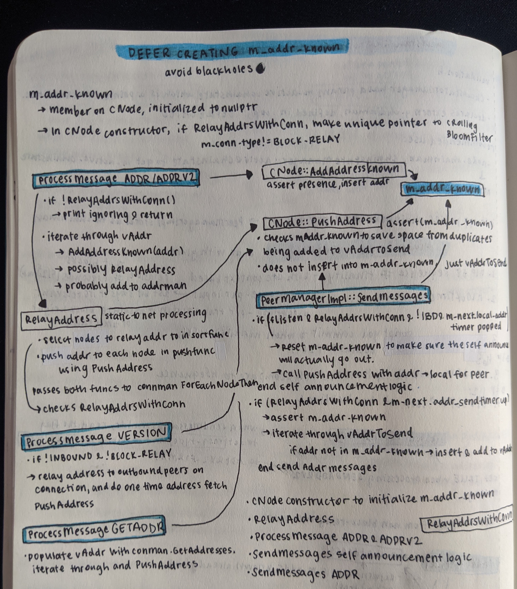

## Defer creating `m_addr_known`

p2p messages: `addr`, `addrv2`, `version`, `getaddr`
keywords: self announcement, self advertisement
functions: `AddAddressKnown`, `PushAddress`, `RelayAddress`,
`RelayAddrsWithConn`

</img>