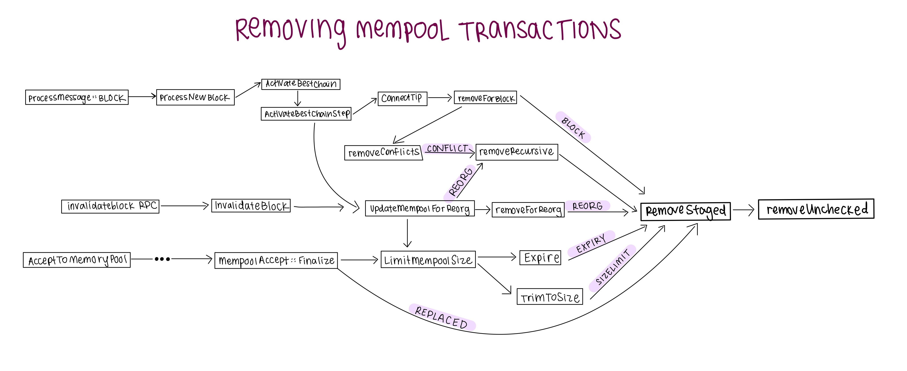

## Removing mempool transactions

MemPoolRemovalReasons:
```
    EXPIRY,      //!< Expired from mempool
    SIZELIMIT,   //!< Removed in size limiting
    REORG,       //!< Removed for reorganization
    BLOCK,       //!< Removed for block
    CONFLICT,    //!< Removed for conflict with in-block transaction
    REPLACED,    //!< Removed for replacement
```

Code paths for each reason:

